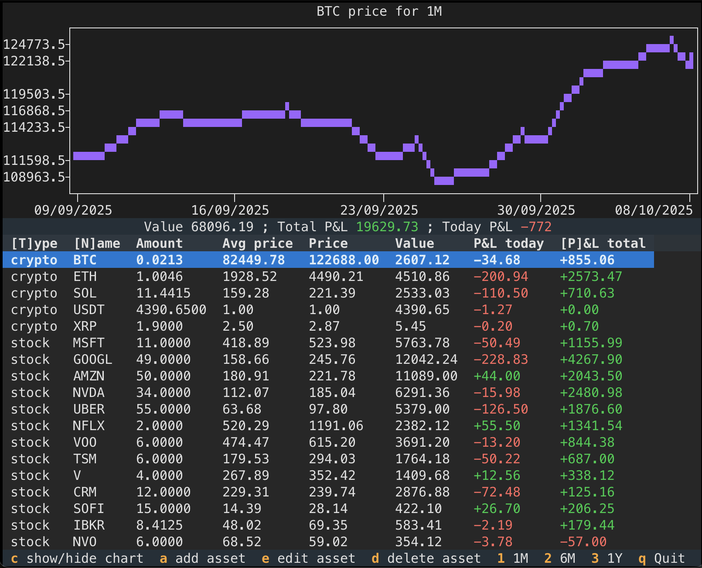

# asset-terminal
## Description
**asset-terminal** is a terminal-based portfolio tracker for stocks and cryptocurrencies. It provides a TUI (Textual User Interface) to manage your assets, visualize price charts, and track profit & loss.
It's fun project so some tech deisions were made "just because".
Project uses API that do not require API keys, so there can be some "lag" in refresh.



## Features
- Track realtime value of your portfolio and price of each asset.
- Add, edit, delete asset to portfolio
- Visualize chart for 1 month, 6 months, 1 year
- Chart data caching
- Table data sorting


## Tech info
### Stack
- [Textual](https://github.com/Textualize/textual) - User interface
- SQLite - For chart caching. Intentionally not using Alchemy, etc. Just plain SQL
- asyncio
- [yfinance](https://github.com/ranaroussi/yfinance) - for receiving stock prices

### APIs
Project uses [coingecko](https://api.coingecko.com) for receiving info about crypto
- api/v3/coins/markets - for receiving current prices
- api/v3/coins/COIN_NAME/market_chart - for receiving chart

COIN_NAME - should be full name of coin. Mapping for short name to full name can ve found in [crypto_mapping](crypto_mapping.json)

## Installation
```sh
uv pip install -e .
```

## License

MIT